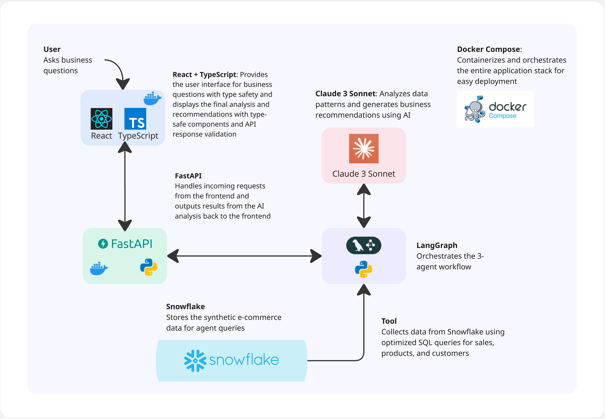
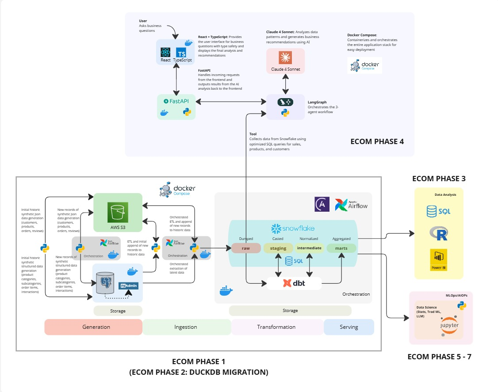

# E-commerce AI Agents

Multi-agent system that analyzes your business data through natural conversation and visualizes insights with charts. Built to stop writing the same Snowflake queries over and over.

**eCommerce AI Agents Diagram**



**Agents Mermaid Diagram**


**eCommerce End-to-End Diagram**



**Dependencies:** Snowflake + Anthropic API + LangGraph

## What it does

Ask questions about your e-commerce data in plain English. The system uses three specialized agents that work together. One extracts data, another analyzes it and generates charts, and a third generates recommendations. The analyst can request additional data if needed, creating an intelligent feedback loop.

**Example queries:**
- "Show me sales trends with visualizations"
- "Which products are underperforming this quarter?"
- "Compare customer segments and recommend focus areas"
- "What's driving our revenue growth?"

## Key Features

- **Intelligent Data Extraction** - LLM-powered agent decides what data to fetch based on your query
- **Iterative Analysis** - Analyst agent can request more specific data if initial dataset is insufficient
- **Visual Analytics** - Automatic chart generation (line, bar, pie, horizontal bar)
- **Business Recommendations** - Actionable insights focused on revenue, retention, and efficiency
- **Stateful Workflows** - LangGraph maintains conversation context across agent interactions

## Prerequisites

You need [ECOM Phase 1](https://github.com/sclauguico/ecommerce-modern-data-stack) running first. This connects to your Snowflake warehouse with the e-commerce schema.

## Quick Start

1. **Clone and setup:**
```bash
git clone https://github.com/sclauguico/ecom-ai-analyzer.git
cd ecom-ai-agents
```

2. **Environment variables:**
```bash
cp .env.example .env
# Edit .env with your credentials
```

3. **Run with Docker:**
```bash
docker-compose up --build
```

4. **Access:**
- Frontend: http://localhost:3000
- API: http://localhost:8000
- API Docs: http://localhost:8000/docs

## Architecture

### Multi-Agent Workflow
```
User Query
    ↓
Data Extractor (LLM decides what to fetch)
    ↓
Analyst (evaluates data sufficiency)
    ↓
[Needs more data?] → Back to Data Extractor
    ↓
Consultant (generates recommendations)
    ↓
Results + Visualizations
```

### Components

- **React Frontend** - Interactive dashboard with Recharts visualizations
- **FastAPI Backend** - Async REST API handling agent orchestration
- **LangGraph Agents**:
  - **Data Extractor**: LLM-powered agent that intelligently fetches from Snowflake
  - **Analyst**: Evaluates data, identifies patterns, can request additional data
  - **Consultant**: Generates specific business recommendations
- **Claude 3 Sonnet** - Powers agent decision-making and analysis
- **Snowflake** - Data warehouse with e-commerce data
- **Pydantic Models** - Type-safe state management across agents

## Development

### Local Setup

**Backend:**
```bash
cd backend
python -m venv venv
venv\Scripts\activate  # mac: source venv/bin/activate
pip install -r requirements.txt
python main.py
```

**Frontend:**
```bash
cd frontend
npm install
npm start
```

### Testing
```bash
# Test Snowflake connection
python backend/test_snowflake.py

# Test agents independently
python backend/langgraph_agents.py

# Test API endpoints
curl http://localhost:8000/health
curl http://localhost:8000/quick-insights

# Test analysis with feedback loop
curl -X POST http://localhost:8000/analyze \
  -H "Content-Type: application/json" \
  -d '{"query": "Show me revenue trends and top products with charts"}'
```

## Configuration

### Environment Variables
```bash
# Snowflake (required)
SNOWFLAKE_USER=your_user
SNOWFLAKE_PASSWORD=your_password
SNOWFLAKE_ACCOUNT=your_account
SNOWFLAKE_WAREHOUSE=your_warehouse
SNOWFLAKE_DATABASE=your_database
SNOWFLAKE_RAW_SCHEMA=your_schema
SNOWFLAKE_ROLE=your_role

# Anthropic (required)
ANTHROPIC_API_KEY=your_api_key
```

### Available Data Functions

The Data Extractor agent can intelligently call:
- `get_sales_metrics(days)` - Revenue, orders, average order value
- `get_top_products(limit)` - Best performing products by revenue
- `get_customer_segments()` - Customer distribution analysis
- `get_sales_trend(days)` - Time series data for charts
- `get_revenue_by_category()` - Category breakdown for pie charts
- `get_monthly_comparison(months)` - Month-over-month metrics
- `get_customer_lifetime_value(limit)` - Top customers by LTV

## API Endpoints

| Endpoint | Method | Description |
|----------|--------|-------------|
| `/health` | GET | Service health check |
| `/quick-insights` | GET | Dashboard KPI metrics |
| `/analyze` | POST | Submit query for multi-agent analysis |
| `/docs` | GET | Interactive API documentation |

### Analysis Response Structure
```json
{
  "analysis_id": "string",
  "query": "user question",
  "status": "completed",
  "results": {
    "data": { /* fetched datasets */ },
    "analysis": "bullet-pointed insights",
    "recommendations": "actionable suggestions",
    "charts": [
      {
        "type": "line|bar|pie|horizontal_bar",
        "title": "Chart Title",
        "data_key": "dataset_name",
        "x_field": "dimension",
        "y_fields": ["metrics"]
      }
    ]
  }
}
```

## Agent State Management

Using Pydantic models for type-safe state:
```python
class AnalysisState(BaseModel):
    query: str                    # User's question
    data: Dict[str, Any]          # Accumulated datasets
    analysis: str                 # Analyst's insights
    recommendations: str          # Business suggestions
    charts: List[Dict]            # Visualization configs
    needs_more_data: bool         # Feedback flag
    data_requests: List[str]      # Specific data needs
    iteration_count: int          # Prevent infinite loops
```

## Deployment

### Docker (Recommended)
```bash
# Production build
docker-compose up -d --build

# Monitor logs
docker-compose logs -f backend
docker-compose logs -f frontend

# Stop services
docker-compose down
```

### Manual Deployment

Requires Python 3.11+, Node 18+, properly configured environment variables.

## Troubleshooting

**Agent not fetching right data:**
- Check the Data Extractor prompt in `langgraph_agents.py`
- Verify Snowflake functions return expected structure
- Enable debug logging to see LLM decisions

**Analyst stuck in loop:**
- Max iterations set to 3 in `should_continue()`
- Check `data_requests` are being cleared properly
- Verify data structure matches analyst expectations

**Charts not rendering:**
- Ensure `data_key` matches top-level keys in data
- Check field names match actual column names
- Verify Recharts components in `App.tsx`

**Snowflake connection issues:**
- Test with `python backend/tool_snowflake.py`
- Verify warehouse is running
- Check role permissions on schema

## Contributing

1. Fork the repository
2. Create feature branch (`git checkout -b feature/smart-agents`)
3. Implement changes with tests
4. Commit (`git commit -m 'Add intelligent data fetching'`)
5. Push (`git push origin feature/smart-agents`)
6. Open Pull Request

## Tech Stack

- **Backend:** Python 3.11, FastAPI, LangGraph, Pydantic
- **Frontend:** React 18, TypeScript, Recharts
- **AI/ML:** Anthropic Claude 3.5 Sonnet, LangChain
- **Data:** Snowflake, Pandas
- **Infrastructure:** Docker, Docker Compose

## What's New from the Original Version:
https://github.com/sclauguico/ecom-ai-analyzer

- **LLM-Powered Data Extraction** - Replaced hardcoded logic with intelligent agent
- **Feedback Loop** - Analyst can request specific additional data
- **Pydantic State Models** - Type-safe state management replacing TypedDict
- **Enhanced Visualizations** - Smart chart generation based on data patterns
- **Iterative Analysis** - Agents collaborate until data sufficiency achieved

## Demonstration Video

Please refer to this [link](https://www.loom.com/share/603f79fa7a27499596fe2dd44ddd4233)

## Documentation Article

Refer to this [Medium article](https://medium.com/@sclauguico/ecom-phase-4-building-ai-agents-for-e-commerce-analytics-with-langgraph-fd1b2471482d)

## Related Projects

- [ECOM Phase 1](https://github.com/sclauguico/ecommerce-modern-data-stack) - Data Engineering Pipeline
- [ECOM Phase 2](https://github.com/sclauguico/project-2) - Snowflake -> DuckDB and MotherDuck
- [ECOM Phase 3](https://github.com/sclauguico/project-3) - SQL - Business Analytics
- [ECOM Phase 4](https://github.com/sclauguico/ecom-ai-analyzer) - Ecommerce AI Agents Analyzer w/o charting capabilites

## Acknowledgments

Big thanks to the educators and tools that made this possible:

- **[Ed Donner](https://www.udemy.com/user/ed-donner-3/)** - LLM Engineering and AI Agents courses
- **[freeCodeCamp with Vaibhav Mehra](https://www.youtube.com/watch?v=jGg_1h0qzaM)** - LangGraph fundamentals
- **[IBM Coursera Specializations](https://www.coursera.org/professional-certificates/ibm-rag-and-agentic-ai?)** - RAG and Agentic AI foundations
- **[Tech with Tim](https://www.youtube.com/watch?v=13tMEW8r6C0)** - React + FastAPI integration patterns
- **[Krish Naik](https://www.youtube.com/@krishnaik06)** - End-to-end ML project guidance
- **Claude and ChatGPT** - Debugging assistance and architecture discussions